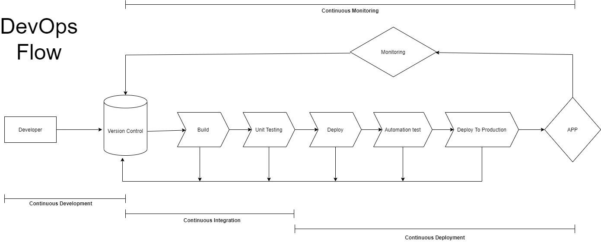
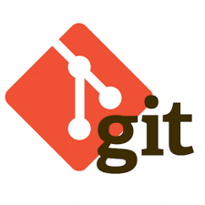
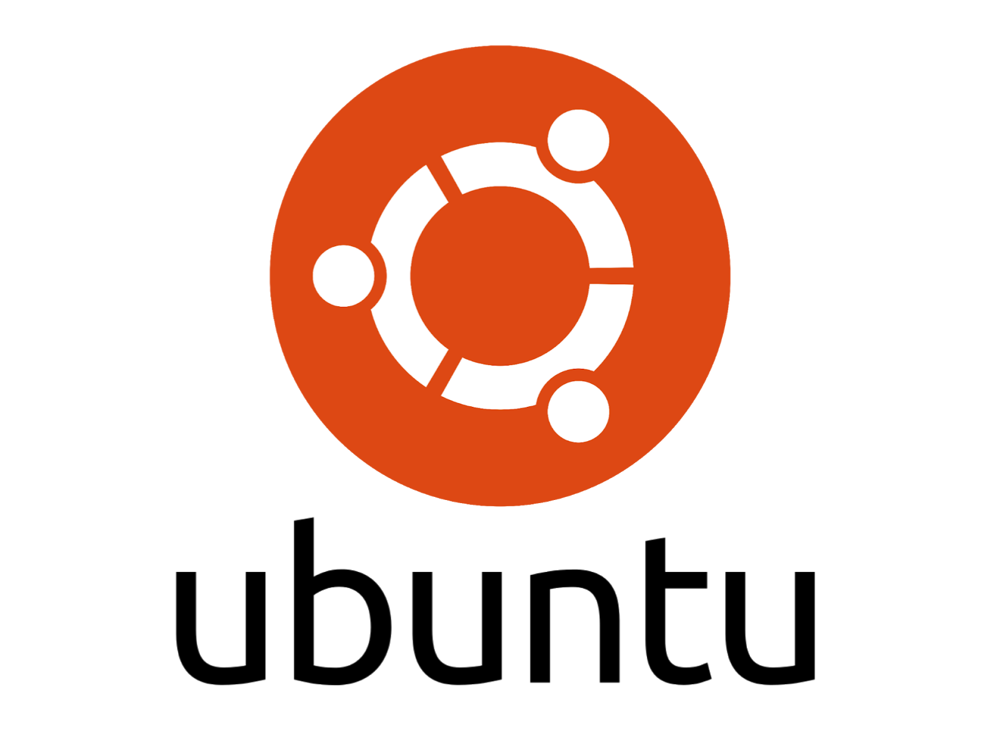

# Penerapan Devops Culture di perusahaan Gojek
Perusahaan Gojek belum menerapkan Devops culture dalam mengembangkan aplikasi mereka, disini saya diberikan tugas untuk menerapkan Devops culture sebagai Devops Engineer guna menyelesaikan masalah dalam pengembangan aplikasi mereka. berikut adalah flow kerja devops yang akan saya terapkan beserta penjelasan toolsnya:

## Gambaran flow devops

## Continuous Development

Continuous Development adalah fase yang melibatkan tahap "Plan" dan "Code". Dalam tahap ini kita merencanakan alur seperti apa untuk kita mengembangkan kode untuk aplikasi. Kode dapat dalam bahasa apapun, tetapi kita mempertahankannya dengan menggunakan version control tools. Proses pemeliharaan kode ini juga dikenal sebagai Manajemen kode.

### Tools yang digunakan

### Alasan menggunakan Git
- Gratis dan opensource
- mendukung dalam proyek besar seperti kernel linux
- visual control system yang terdistribusi

## Continuous Integration

Continuous Integration (CI) merupakan serangkaian proses otomatisasi untuk developer ketika melakukan perubahan code agar dapat diperiksa dulu sebelum masuk kedalam tahap Continuous Deployment. Hal ini diperlukan agar dapat mengetahui terjadinya error lebih cepat. 

### OS

Ubuntu adalah sebuah sistem operasi dan distribusi Linux berbasis Debian yang gratis dan open-source. Sistem operasi ini dibangun dengan menggunakan infrastruktur Debian dan terdiri dari server, desktop, dan sistem operasi Linux.

### Alasan menggunakan ubuntu 
- lebih aman dari serangan virus
- mudah dikostumisasi
- Gratis dan opensource

### Build Server

Jenkins adalah sebuah server otomatisasi berbasis open-source, dengan integrasi berkelanjutan. Pada dasarnya, jika Anda seorang pengembang yang terus menerus membuat program baru dan berbagai perangkat lunak, namun Anda tidak menggunakan Jenkins, Anda rugi dan kehilangan banyak waktu Anda. Jenkins memungkinkan pengembang untuk menguji program mereka saat bepergian, semuanya memungkinkan untuk mengintegrasikan peningkatan dan fitur tambahan melalui proses tersebut.

### Alasan menggunakan jenkins 
- Jenkins memiliki banyak sekali plugins yang dapat mengintegrasi Jenkins dengan banyak tools dalam untuk membantu proses build, test, dan deploy.
- Gratis dan opensource

## Continuous Deployment

Continous deployment adalah proses menjaga agar codebase dapat di-deploy kapanpun. Jika codebase bisa di-deploy maka codebase bisa ter-deploy secara otomatis dengan melakukan deployment setiap ada perubahan. Continuous deployment memanfaatkan proses yang serupa seperti CI, yaitu automatic build dan automatic testing. Dengan CD fitur terbaru akan semakin cepat sampai di tangan pengguna.

### Container

Docker adalah layanan yang menyediakan kemampuan untuk mengemas dan menjalankan sebuah aplikasi dalam sebuah lingkungan terisolasi yang disebut dengan container. Dengan adanya isolasi dan keamanan yang memadai memungkinkan kamu untuk menjalankan banyak container di waktu yang bersamaan pada host tertentu.

### Alasan menggunakan docker
- Memiliki konfigurasi yang sederhana
- Dapat Melakukan Pengujian dan Distribusi Aplikasi Secara Terus Menerus
- Tingkat keamanan yang baik

## Continuous Monitoring
Continuous Monitoring adalah sebuah proses mengawasi dan menjaga produk aplikasi yg sudah dibuat. Guna mengetahui bagaimana aplikasi digunakan oleh pengguna. Dalam praktek DevOps, monitoring merupakan hal yang sangat penting. Tim pengembang harus mengetahui bagaimana perubahan kodenya berdampak pada produk juga penggunanya melalui monitoring tools.

### Monitoring Tools

Splunk adalah platform pengumpul dan analisis data untuk memonitor, mengumpulkan, dan menganalisis data dari berbagai macam sumber daya jaringan (contoh: event logs, perangkat, layanan, traffic TCP/UDP, dll.). Kamu dapat mengatur pengaturan pemberitahuan untuk memberi notifikasi ketika terjadi sesuatu atau menggunakan fitur pencarian ekstensif dari Splunk, fitur pelaporan dan dasbor agar data yang terkumpul dapat dimanfaatkan dengan maksimal. Splunk juga menyediakan ‘Apps’ untuk menambah fungsionalitas sistem.

### Alasan menggunakan splunk
- dapat mengubah data kompleks menjadi informasi sederhana.
- memantau arus operasional secara real time.

