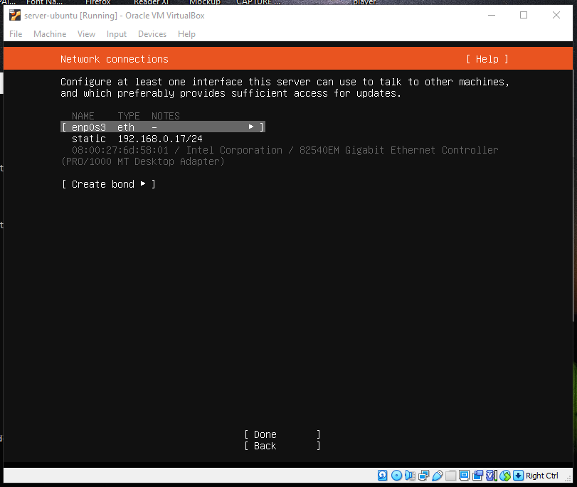

# Installasi Linux Ubuntu Server di Virtual Box
Berikut adalah proses installasi Linux di Virtual Machine:

## Pertama 

### Siapkan aplikasi Virtual Box dan iso file ubuntu yg sudah didownload. Kemudian buka aplikasi Virtual box dan Klik NEW 

## Kedua 

### Kemudian akan muncul module dan isikan dengan nama,type dan versi OS yg akan diinstall. sesuaikan dengan spesifikasi laptop anda,lalu klik next.

## Ketiga 

### Pada bagian Memori Size, anda bisa mengatur seberapa besar memori yg akan digunakan. Namun jika terlalu besar akan membuat perangkat laptop anda menjadi sedikit lambat, maka disarankan menggunakan memori setengah dr memory keseluruhan anda. Jika sudah klik next.

## Keempat 

### Kemudian pada bagian HardDisk, Anda dapat membuat hard disk virtual, lalu klik next.

## Kelima 

### Ada banyak tipe hard disk virtual, disini kita menggunakan VDI (VirtualBox Disk Image) yaitu tipe standard yang digunakan VirtualBox, lalu klik next.

## Keenam 

### Selanjutnya, kita memilih penyimpanan fisik pada hard disk. Disini kita menggunakan Dynamic Allocated, lalu klik next.

## Ketujuh 

### Tentukan lokasi penempatan virtual hard disk Anda sekarang beserta ukurannya. Jangan lupa klik Create.

## Kedelapan 

### Setelah selesai, kemudian langkah selanjutnya klik setting lalu pilih storage dan klik pada gambar disk bertuliskan empty dan search iso yg sudah didownload dengan mengklik gambar disk biru dikanan. setelah file iso sudah dipilih klik ok.

## Kesembilan 

### kemudian klik start dan ketika tampil pilih bahasa sesuai dengan yg kamu inginkan, disarankan memilih bahasa English. lalu tekan enter.

## Kesepuluh 

### Kemudian pada Keyboard Configuration pilih sesuai yg kamu inginkan, tapi disarankan memilih English(US) pada bagian Layout dan variant. lalu pilih done dan enter.

## Kesebelas 

### Kemudian pada bagian Network Connection kita bisa setup ip kita sendiri, pilih enp0se3 lalu pilih manual dan isikan ip wifi atau modem kita, lalu isi ip yg ingin kita custom, lalu isi gateway sesuai default gateway milik wifi kita lalu save. dan jika sudah klik done

## Keduabelas 

### Kemudian pada Configuration proxy klik done

## Ketigabelas 

### Pada bagian storage configuration pilih costum storage layout. lalu klik done.

## Keempatbelas 

### lalu buat partisi untuk swap sebesar 2 gb lalu create dan buat lagi partisi untuk ext4 sebesar sisa dr storagenya, lalu create. setelah selesai membuat partisi klik done.

## Kelimabelas 

### lalu pada profile setup kita isikan nama, nama server, username, password. ini berguna ketika kita akan memasuki mode root nanti. setelah selesai klik done

## Keenambelas 

### lalu pada SSH setup kita pilih done saja. kemudian ubuntu server kita akan diinstall dan kita hanya perlu menunggu sampai proses selesai. ketika proses selesai masukkan username yg sudah dimasukkan tadi beserta passwornya.

