# Bash Script
Berikut adalah perintah-perintah bash script:

## mkdir 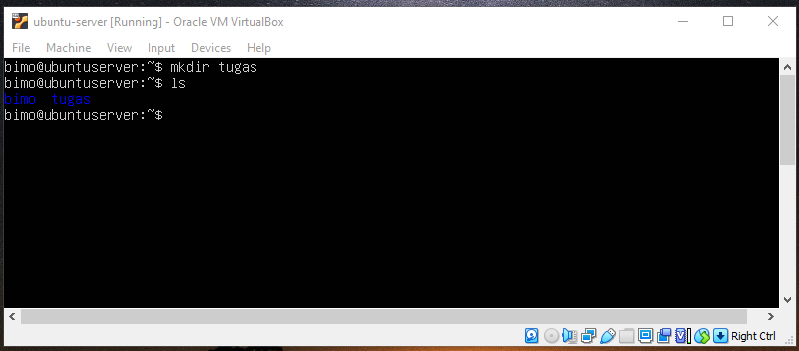
mkdir adalah perintah membuat sebuah folder/direktori. Berikut contoh penggunaannya:
- mkdir nama-direktori

## cd 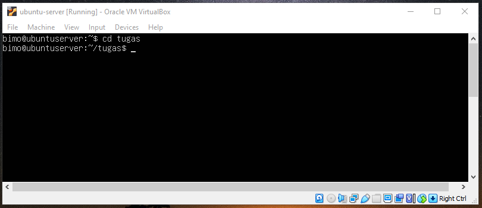
cd adalah sebuah perintah untuk berpindah atau masuk kedalam direktori tertentu. Berikut contoh penggunaannya:
- cd nama-direktori

## ls 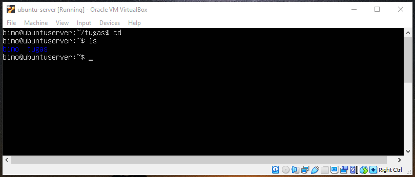
ls adalah sebuah perintah untuk melihat direktori apa saja yg ada, selain itu kita juga bisa melihat hidden file dengan menambahkan -a. Berikut contoh penggunaannya:
- ls

## PWD 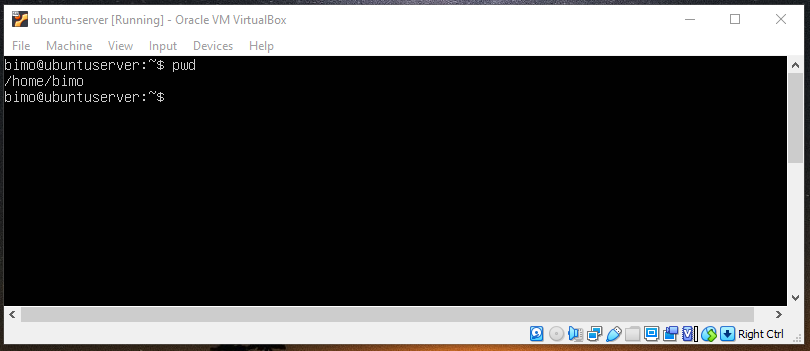
pwd adalah sebuah perintah untuk memberi informasi didirektori mana anda sedang berada. Berikut contoh penggunaannya:
- pwd

## Touch 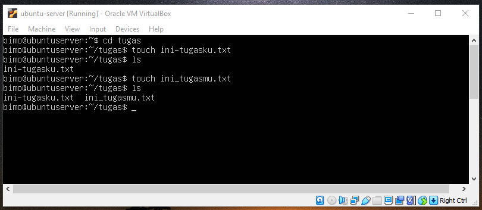
touch adalah sebuah perintah untuk membuat sebuah file baru dengan berbagai jenis format seperti, txt,zip dll. Berikut contoh penggunaannya:
- touch nama-file

## rm 
rm adalah perintah yang digunakan untuk menghapus sebuah file atau sebuah direktori. Berikut contoh penggunaannya:
- rm nama-file/direktori

## cat 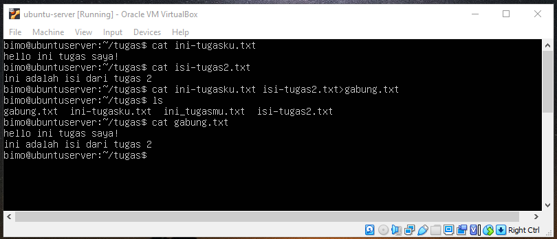
cat adalah sebuah perintah untuk melihat isi file dan juga menggabungkan isi dari 2 file kedalam file baru. Berikut contoh penggunaannya:
- cat nama-file

## find 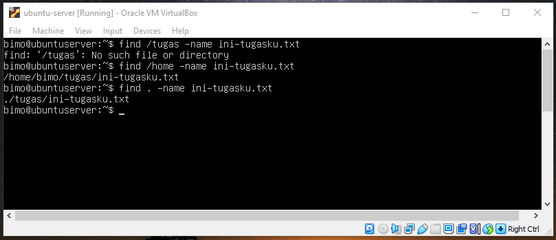
find adalah sebuiah perintah untuk menemukan sebuah file. Berikut contoh penggunaannya:
- find /home -name nama-file
- find . -name nama-file

## mv 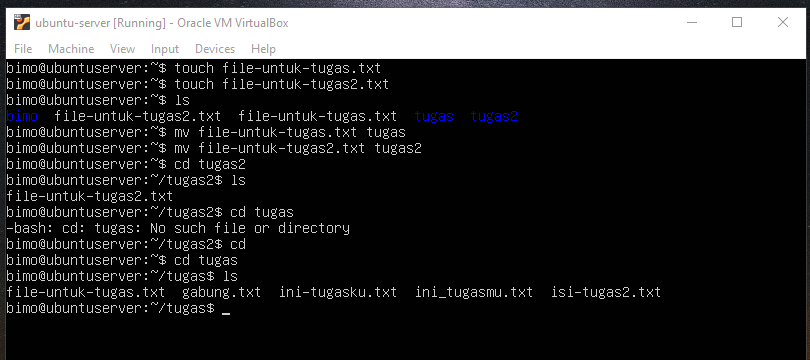
mv adalah sebuah perintah untuk memindahkan sebuah file atau direktori. Berikut contoh penggunaannya:
- mv nama-file folder-tujuan

## cp 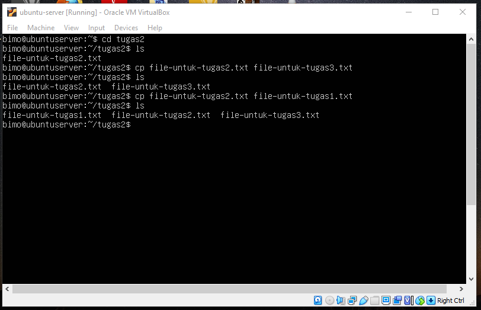
cp adalah sebuah perintah untuk mengcopy sebuah file atau folder. Berikut contoh penggunaannya:
- cp file-asli file-copy

## history 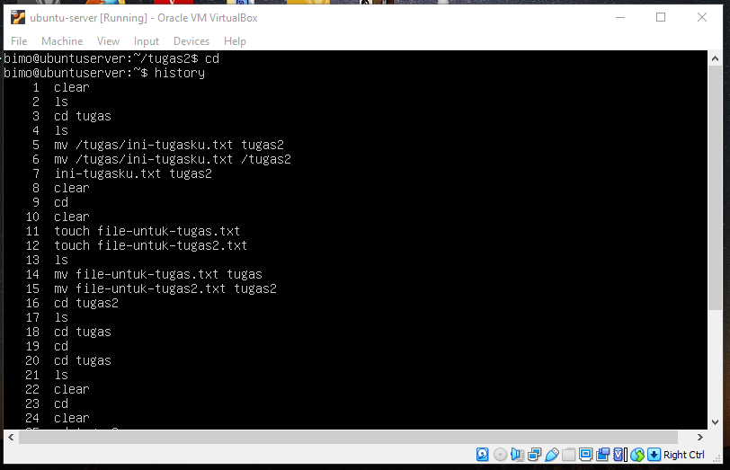
history adalah sebuah perintah untuk memperlihatkan perintah2 apa saja yg sudah pernah kita jalankan. Berikut contoh penggunaannya:
- history

## uname 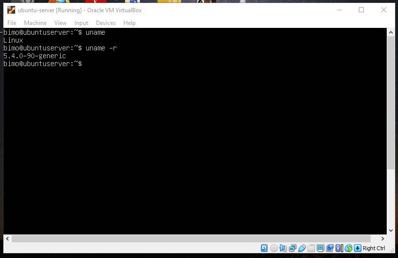
uname adalah sebuah perintah untuk mengetahui system operasi apa yg kita gunakan, lalu jika ditambah -r maka yg akan muncul adalah versi dr sistem operasi kita. Berikut contoh penggunaannya:
- uname

## df 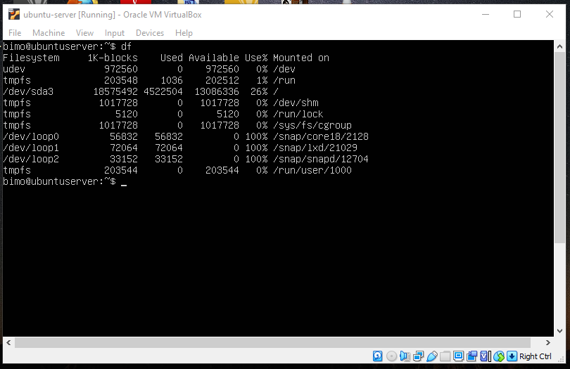
df adalah sebuah perintah untuk melihat statistik penggunaan disk. Berikut contoh penggunaannya:
- df

## sudo 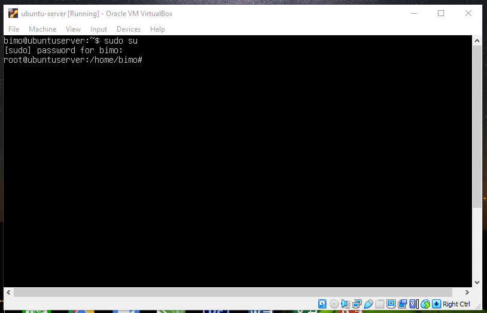
sudo adalah sebuah perintah untuk menjadikan kita sebagai super user. Berikut contoh penggunaannya:
- sudo su

## ping 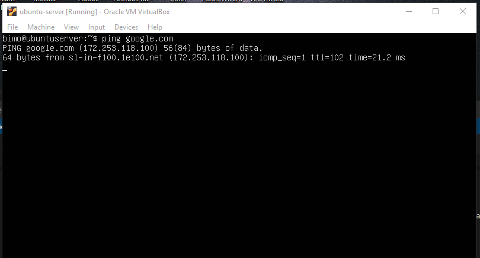
ping adalah sebuah perintah untuk mengecek apakah kita terhubung dengan jaringan atau tidak dan apakah jaringannya stabil atau tidak. Berikut contoh penggunaannya:
- ping ip-tujuan

## wget 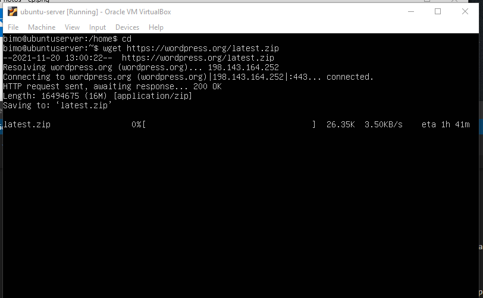
wget adalah sebuah perintah yg biasa digunakan untuk mengunduh/download. Berikut contoh penggunaannya:
- wget alamat-file-yg-diunduh

## exit 
exit adalah perintah yg digunakan untuk keluar dari mode root/ super user. Berikut contoh penggunaannya:
- exit