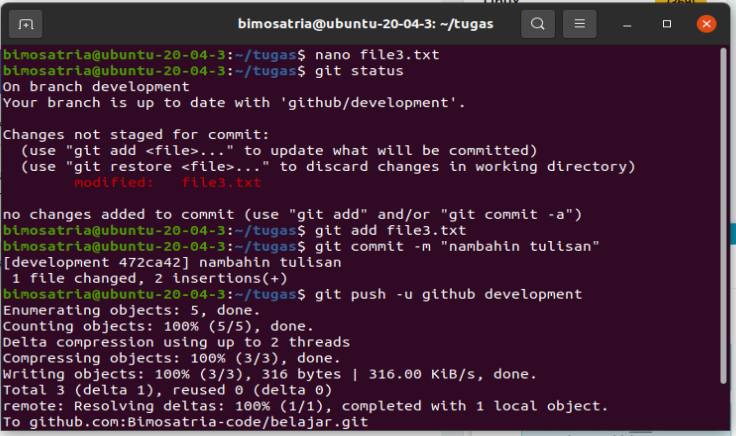
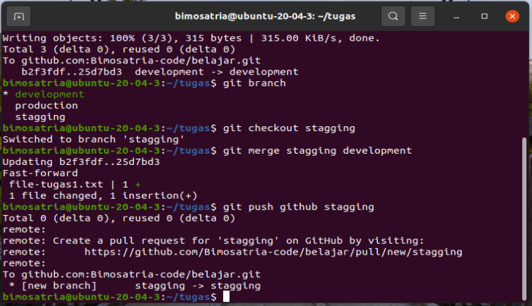
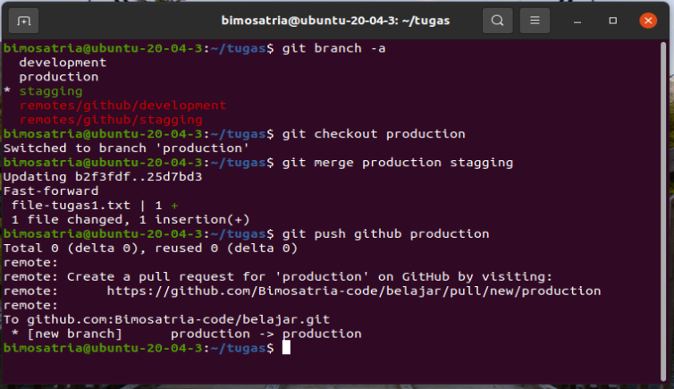

# Study Case Update branch
Berikut study case untuk mengupdate branch, jadi saya mengupdate sebuah file yg berada didalam branch development. Kemudian saya akan mengupdatenya ke branch stagging dan ke branch production

## Update file dibranch development

- Dilangkah awal ini saya memiliki sebuah file yg akan saya update file3.txt.
- kemudian langkah selanjutnya adalah menjalankan perintah $git add fileuntuk menandai file yg akan dipush.
- lalu selanjutnya jalankan perintah commit untuk memberi tahu jika ada update/perubahan $git commit -m "nambahin tulisan".
- lalu setelah dicommit push file dengan perintah $git push -u github development. Dan tunggu hingga file terupdate kedalam repository kita dibranch development.

## Update file dibranch stagging

Dilangkah ini kita akan mengupdate file yg sudah kita update di branch development ke branch stagging. berikut langkah-langkahnya:
- Pertama Kita berpindah dulu kebranch stagging dengan perintah $git checkout stagging. Untuk mencek apakah sudah berpindah branch kita bisa menjalankan perintah $git branch.
- Kemudian langkah berikutnya adalah kita akan menggunakan perintah $git merge, perinta ini berfungsi untuk menggabungkan branch/cabang menjadi satu kembali dengan artian file yg sudah kita update dibranch development nantinya juga akan terupdate.
- Dengan perintah $git merge stagging development file tersebut juga akan terupdate didalam branch stagging.
- Langkah terakhir adalah push repository dengan perintah $git push -u github stagging

## Update file dibranch production

Dilangkah ini kita akan mengupdate file yg sudah kita update di branch development dan branch stagging ke branch production. berikut langkah-langkahnya:
- Pada langkah ini kita akan mengupdate branch production, kita akan mengupdate branch production dari branch stagging. pertama kita masukkan $git checkout production dengan kata lain kita harus berpindah dulu menuju branch yg akan diupdate.
- Sama seperti langkah update di branch stagging kita masukkan perintah $git merge, tapi bedanya adalah kita masukkan $git merge branch production stagging, jadi kita masukkan branch production dulu lalu masukkan branch stagging sebagai branch yg akan disatukan.
- Langkah terakhir adalah push repository dengan perintah $git push -u github production