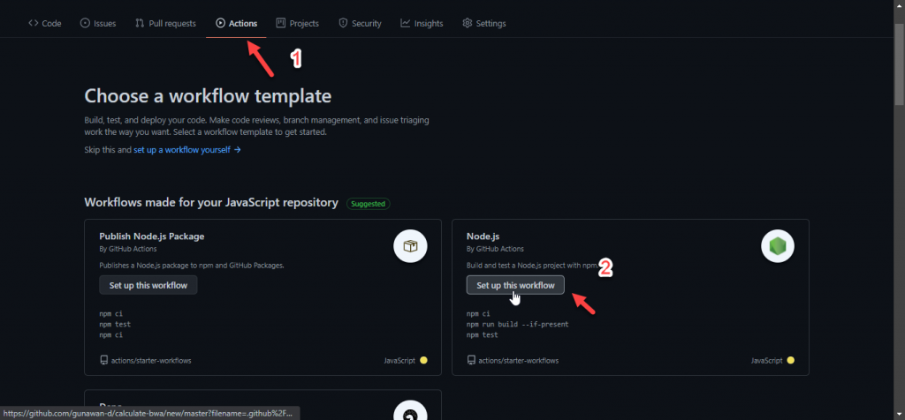
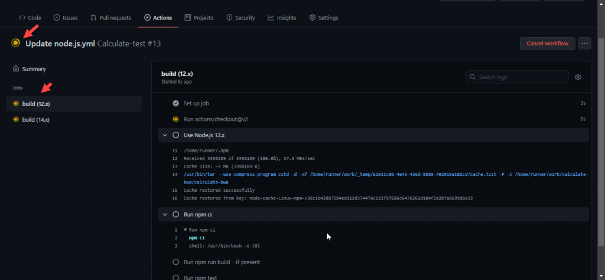
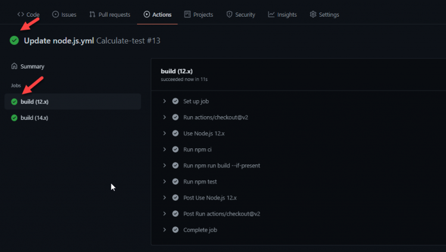
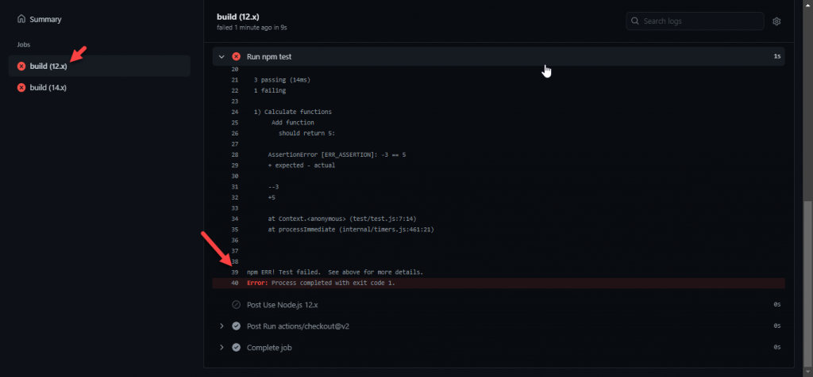
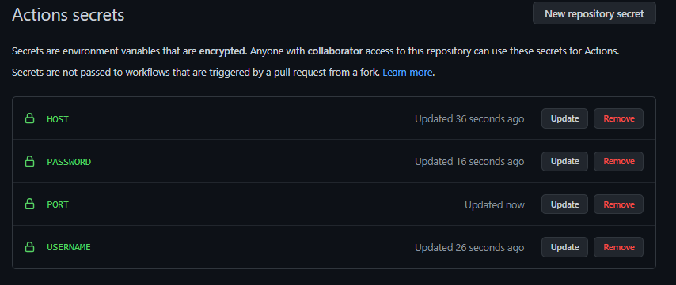
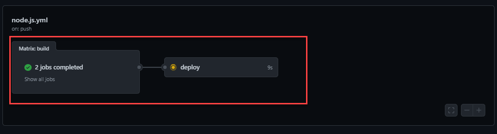
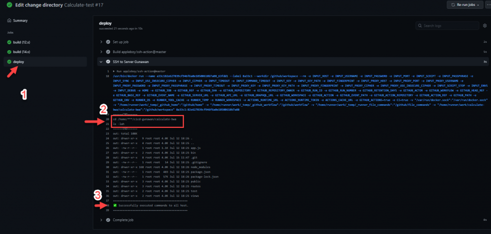

# Proses CI/CD Github Actions
Berikut penjelasan proses dan langkah CI/CD dengan menggunakan github actions:

## Prosses CI (Continuous Integration)
## Step 1
- Pada step pertama kita membuat sebuah repository baru sebagai tempat CI/CD kita, lalu kita push project aplikasinya kerepository kita ini.

## Step 2
- kemudian kita Create Workflow, disini kita dapat membuat workflow secara manual dan bisa juga setup secara tamplate. workflow dibuat dengan ekstension .yml, lalu edit template source code .yml sesuai dengan kebutuhan kita. Setelah setup selesai kemudian selanjutnya adalah commit dengan memberikan module commit bisa default atau sesuai kalimat kita sendiri.

## Step 3
- Kemudian masuk ke menu Github Actions disitu akan terlihat workflow yang kita buat tadi, untuk commit sendiri menyesuaikan yang kita buat atau yang kita commit tadi.

- Jika proses CI berjalan dia akan berwarna kuning seperti ini

- Dan jika workflow yang kita buat berhasil maka akan ada tanda checklist warna hijau dengan begitu tandanya kita berhasil melakukan Continouse integrations menggunakan GitHub.

## Step 4
- Selanjutnya kita akan mencoba melakukan pengecekan atau pengujian terhadap CI workflow yg kita buat digithub action tadi dengan cara sengaja merubah salah satu code seolah-olah code tersebut error. kemudian kita push dan commit kembali ke repository kita.
- Sebelum push kita melakukan pull terlebih dahulu mengingat tadi kita melakukan adding Workflows di github actions
- Kemudian kita check di Github actionsya dia akan melakukan running jobs otomatis setelah kita push repository
- Hasilnya pasti terdapat error dan terdapat tanda silang. Error tersebut adalah tanda bahwa code yang kita buat harus di check lagi sebelum di push , selain itu notif error akan terkirim ke email account github kita sebagai penanda bahwa kita harus melakukan fixing bug tsb.

## Prosses CD (Continuous Deployment)
## Step 1
- Pada step ini kita langsung membuat workflow untuk CD dengan exktension file .yaml, kemudian setup seperti pada proses CI dan disini kita menambahkan 1 jobs untuk continuous yaitu untuk SSH ke server kita dari github.

## Step 2
- Disini kita akan menambahkan variable yang telah kita buat tadi di file workflows maka dari itu kita add variable tersebut di menu setting -> secret 
- Kemudian add repository secret dimana ada 4 yang kita tambahkan, yaitu:
    - Host = IP
    - USERNAME = User server
    - PASSWORD = password server
    - PORT = Port SSH server

- Disini kita hanya bisa update dan remove jadi semisal ada yang akan akses repo tidak akan bisa melihat secret tersebut.

## Step 3
- Karena kita sudah melakukan beberapa penambahan jobs baru di workflow github selanjutnya kita melakukan psuh kerepository seperti kita biasa kita melakukan push code.

## Step 4
- Jika kita sudah melakukan update repo ke github dan juga kita sudah menyambunkan github dengan server maka semua repo yang kita update akan terintegrasi ke dalam server yang sudah di pointing menggunakan fitur secret tadi. ada 2 buah jobs tampilan yg kita buat yaitu testing & deploy.
    - jobs 1 adalah run NPM testing
    - Jobs 2 adalah deploy yang dimana isinya adalah (conect ke server menggunakan ssh dan menjalankan script atau command yang kita buat)

- Dengan output jobs deploy akan terlihat seperti ini

- Disini menandakan bahwa proses CD kita berhasil