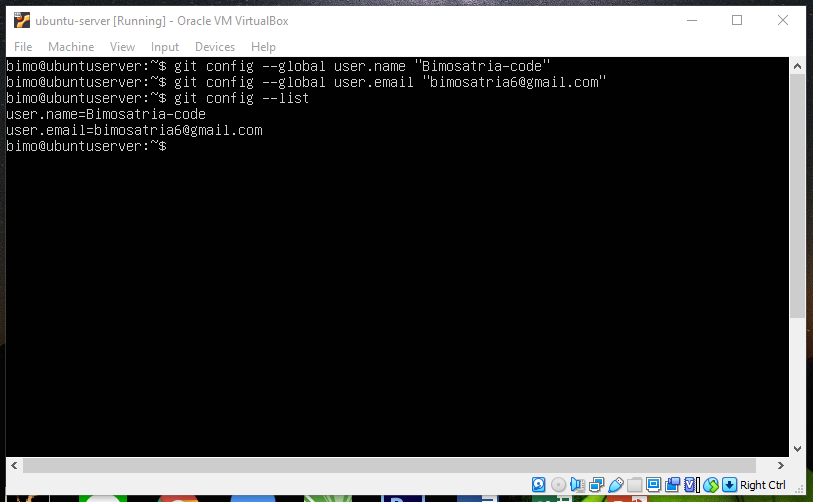
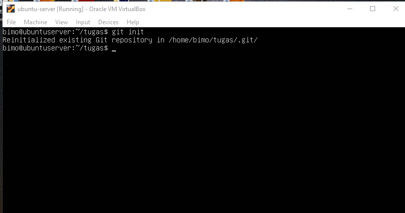
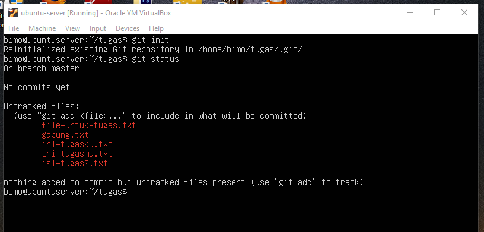
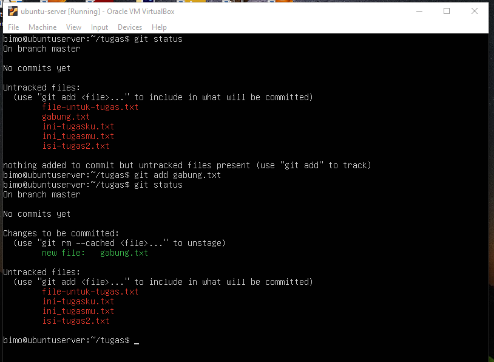
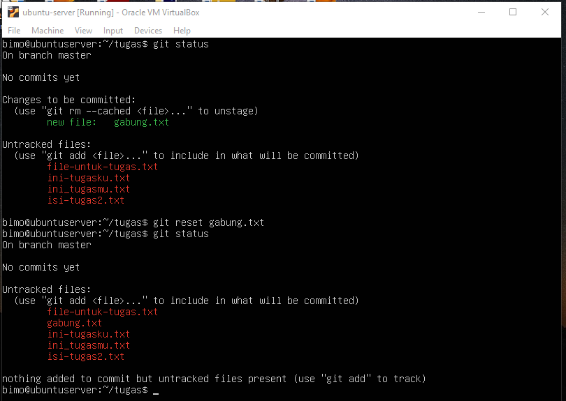
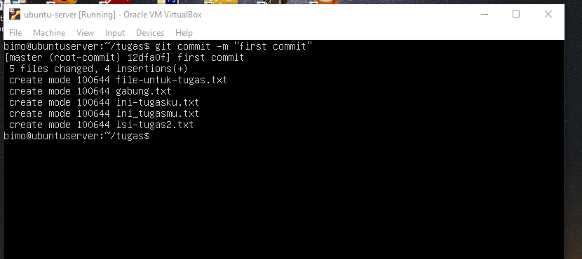
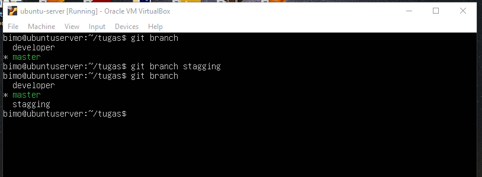
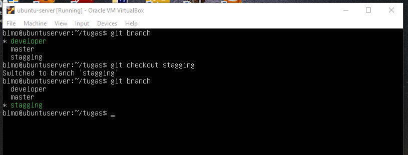
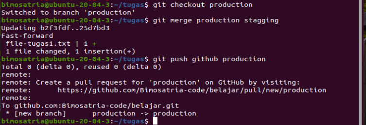
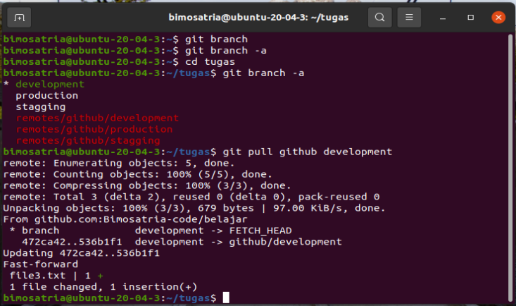

# Perintah-Perintah Git untuk versioning
Berikut adalah perintah-perintah git untuk versioning beserta penjelasan kegunaannya:

## Git config

Git init adalah perintah untuk pengaturan configurasi git dengan memasukkan username dan email yang terdaftar digithub.
- $git config --global user.name "nama github"
- $git config --global user.email "email github"

## Git Init

Git init adalah perintah untuk menginisialisasi.
- $git init

## Git status

Git status adalah perintah untuk memperlihatkan file apa saja yg siap untuk diadd.
- $git status

## Git add

Git status adalah perintah untuk memperlihatkan file apa saja yg siap untuk diadd.
- $git add .
- $git add nama_file

## Git reset

Git reset adalah perintah untuk membatalkan file yg sudah ditandai.
- $git reset nama_file

## Git commit

Git commit adalah perintah untuk menyimpan perubahan yang dilakukan, tetapi tidak ada perubahan pada remote repository.
- $git commit -m "first commit"

## Git branch

Git branch adalah perintah untuk membuat percabangan.
- $git branch new_branch"

## Git checkout

Git checkout adalah perintah untuk berpindah branch.
- $git checkout branch_tujuan"

## Git Merge

Git merge adalah perintah untuk menggabungkan branch, beguna juga untuk mengupdate dr branch awal ke branch cabang.
- $git merge (branch yg akan diupdate) (branch yg filenya sudah diupdate)"

## Git pull

Git merge adalah perintah untuk menyelaraskan perubahan atau update yg terjadi diweb git secara online.
- $git pull origin (nama branchnya)