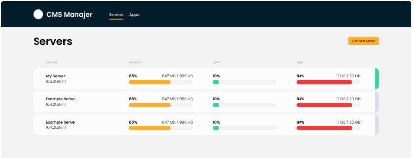

# Cmsmanajer
## Cmsmanajer adalah sebuah platform yang dibuat untuk memanajement banyak server dalam satu dashboard dan memudahkan kita untuk menginstall aplikasi yang dibutuhkan dengan sekali klik. Selain itu Cmsmanajer juga mengoptimalkan konfigurasi kernel, security dan performance pada server. Berikut dokumentasi penggunaan cmsmanajer:

## langkah 1
### Pertama kita mendaftar akun jika belum memiliki akun dengan mengklik tombol sign up, kemudian akan tampil form isikan nama, email, password, nomer hp, negara dan pekerjaan kemudian klik create akun. setelah itu aktivasi akun kita dengan cara klik link aktivasi diemail yg dikirim oleh cmsmanajer.

## langkah 2
### Selanjutnya kita login dengan akun yg sudah kita daftarkan dan akan muncul tampilan berikut.

### Kemudian kita klik connect server

## langkah 3
### Setelah kita klik connect server akan muncul form
- pilih nginx, apache atau isikan nanti
- nama server yg akan kita buat
- ip address server kita
- username 
- isikan password atau gunakan ssh key

### Tunggu beberapa saat Cmsmanajer akan memeriksa koneksi dan mulai meninstall. proses ini akan mengatur firewall,optimasi kernel dan lain-lain.

## langkah 4
### Setelah selesai disini akan tampil list server kita.

## langkah 5
### Terakhir kita dapat mengistall aplikasi kedalam server kita. Caranya adalah seperti berikut:
- klik app pada navbar
- kemudian akan muncul form dan isikan dengan app apa yang akan di install atau create keserver kita.
- lalu masukan nama, domain, system user, title, username, password dan email
- dan klik create
