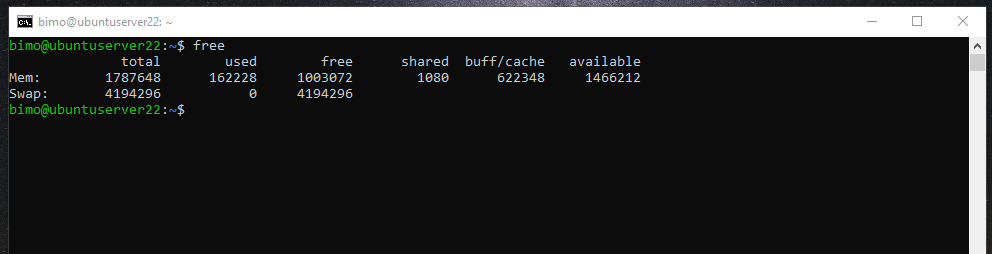

# Dokumentasi Manage Server With Terminal 2
Berikut adalah dokumentasi cara memanage server dengan terminal:

## FREE
### Free adalah perintah pada sistem linux untuk menampilkan jumlah total memory fisik dan swap sistem dan buffer yang digunakan oleh kernel

## Iostat
### Iostat adalah perintah yang digunakan untuk memantau beban perangkat input / output sistem, melihat berapa lama perangkat aktif dalam kaitannya dengan kecepatan transfer rata-ratanya. Ini juga dapat digunakan untuk membandingkan aktivitas antar disk.

## NETSTAT
### Netstat adalah perintah untuk menampilkan status jaringan. Perintah netstat memungkinkan anda tahujaringan seluruh sistem linux 

## MPSTAT
### Mpstat Perintah untuk menampilkan aktivitas dari setiap processor, processor 0 merupakan processor pertama. mpstat -P ALL menampilkan rata-rata utilitas CPU per processor.

## VMSTAT
### Vmstat adalah perintah yang memberikan laporan informasi tentang proses,memory,paging,IO blok,traps, dan aktivitas CPU
