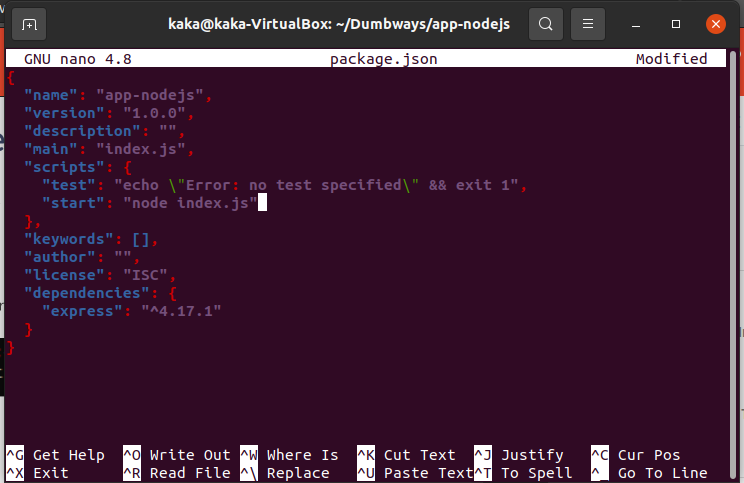
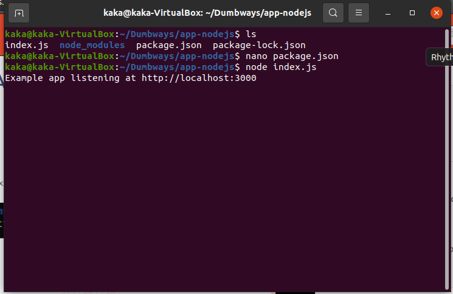
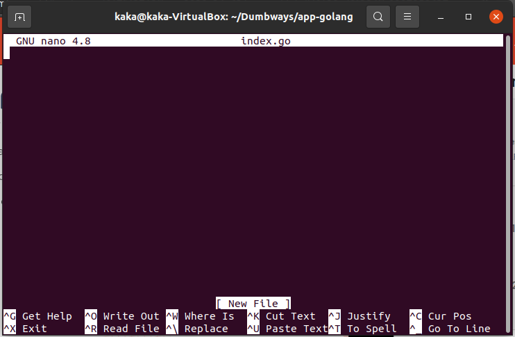

# Dokumentasi Membuat aplikasi nodejs, python3 dan golang
Berikut adalah dokumentasi proses pembuatan dari setiap aplikasi:

## Langkah-langkah installasi Nodejs
### Pertama langkah installasi dengan memasukkan perintah-perintah berikut satu per satu:
- curl -o- https://raw.githubusercontent.com/nvm-sh/nvm/v0.38.0/install.sh | bash
- 

- nvm install 16.13.0
- nvm use 16
- 

### Berikutnya setelah langkah installasi selesai, untuk melakukan pengecekan masukkan perintah-perintah berikut satu per satu:
- node -v
- npm -v
- 

### Jika nvm belum terdeteksi, masukkan perintah-perintah berikut:
- exec bash
- exec zsh

### Kemudian langkah-langkah pembuatan aplikasi, masukkan perintah-perintah berikut:
- mkdir app-nodejs
- cd app-nodejs
- npm init -y
- 

### Kemudian buka file package.json dengan nano kemudian tambahkan perintah start pada script, berikut contohnya:
- nano package.json
- 

### lalu setelah itu install express, masukkan perintah berikut:
- npm install express -y
- 

### lalu setelah install express selanjutnya adalah membuat file index.js dimana didalamnya adalah berisi code aplikasi yg akan dijalankan, masukkan perintah berikut untuk membuat index.js:
- nano index.js
- 

### lalu setelah itu simpan file dan jalankan perintah berikut untuk menjalankan aplikasinya:
- node index.js
- 

### Kemudian terakhir jalankan pada web browser: http://localhost:3000
- 

## Langkah-langkah installasi Python3
### Pertama langkah installasi dengan memasukkan perintah-perintah berikut satu per satu:
- sudo apt update
- sudo apt upgrade -y
- python3 -V
- sudo apt install python3-pip
- pip install flask

### Kemudian langkah selanjutnya setelah installasi selesai kita masuk ketahap pembuatan aplikasi, dengan memasukkan perintah-perintah berikut satu per satu:
- mkdir app-python
- cd app-python
- nano index.py
- 
- 

### Lalu untuk menjalankannya masukkan perintah berikut:
- python3 index.py
- 

### Kemudian terakhir jalankan pada web browser: http://localhost:5000
- 

## Langkah-langkah installasi Golang
### Pertama langkah installasi dengan memasukkan perintah-perintah berikut satu per satu:
- wget https://golang.org/dl/go1.16.5.linux-amd64.tar.gz && sudo su
- 

- rm -rf /usr/local/go && tar -C /usr/local -xzf go1.16.5.linux-amd64.tar.gz && exit
- export PATH=$PATH:/usr/local/go/bin
- go version
- 

### Berikutnya setelah installasi selesai kita masuk ketahap pembuatan aplikasinya, dengan memasukkan perintah-perintah berikut:
- mkdir app-golang
- cd app-golang
- nano index.go
- 
- 

### Kemudian tahap terakhir kita jalankan aplikasi golang, dengan perintah berikut:
- go run index.go
- go build index.go
- ./index.go
- 

# Addition
## langkah2 install pm2
### Pertama kita install pm2 secara global. berikut perintahnya:
- npm install pm2 -g
- 

### Kemudian setelah itu ketik perintah $pm2 ecosystem simple untuk mendapatkan config ecosystem dan setelah itu edit file ecosystem.config.js, kemudian save lalu jalankan pm2 start, berikut perintahnya:
- pm2 ecosystem simple
- sudo nano ecosystem.config.js
- pm2 start
- 

### Terakhir untuk melihat list aplikasi yg sudah kita jalankan dengan pm2 kita bisa menggunakan perintah berikut:
- pm2 list
- 
