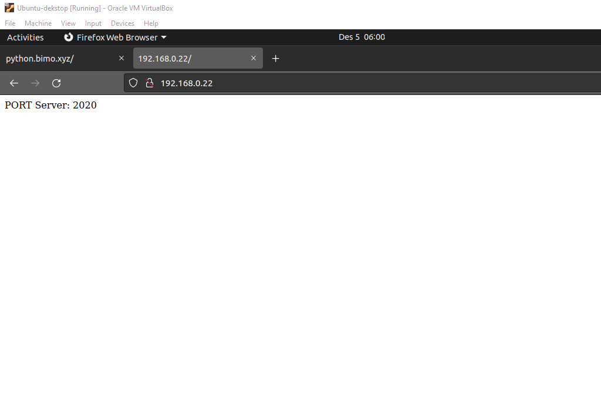

# Dokumentasi Load Balance
Berikut adalah dokumentasi proses pembuatan dari setiap aplikasi:

## Langkah-langkah load balance nginx
### Pertama siapkan ip local host berbeda disini saya menggunakan port yang berbeda:
- 192.168.0.22:2020
- 192.168.0.22:2021

### lalu saya sudah menyiapkan aplikasi backendnya:
- 

### Kemudian kita masuk ke file /etc/nginx dan kita edit file nginx.conf, berikut perintahnya:
- cd /etc/nginx
- sudo nano nginx.conf
- 

### Setelah itu save file dan cek apa config yg kita edit terdapat masalah atau tidak. Lalu reload nginxnya, berikut perintahnya:
- sudo nginx -t
- sudo systemctl reload nginx
- 

### Kemudian jalankan aplikasi di kedua port yg berbeda dan cek dibrowser dengan mereload halaman, berikut perintahnya:
- 
- 
- 
- 