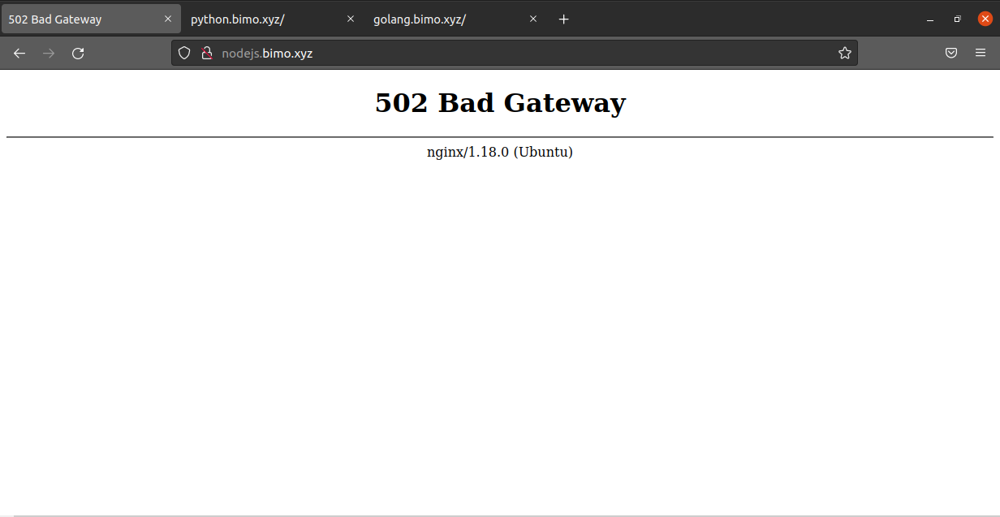
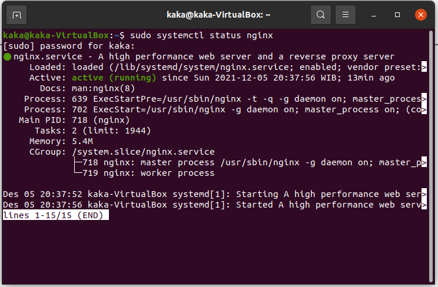
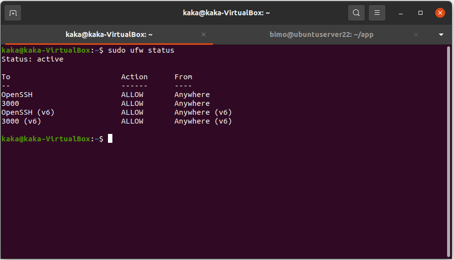
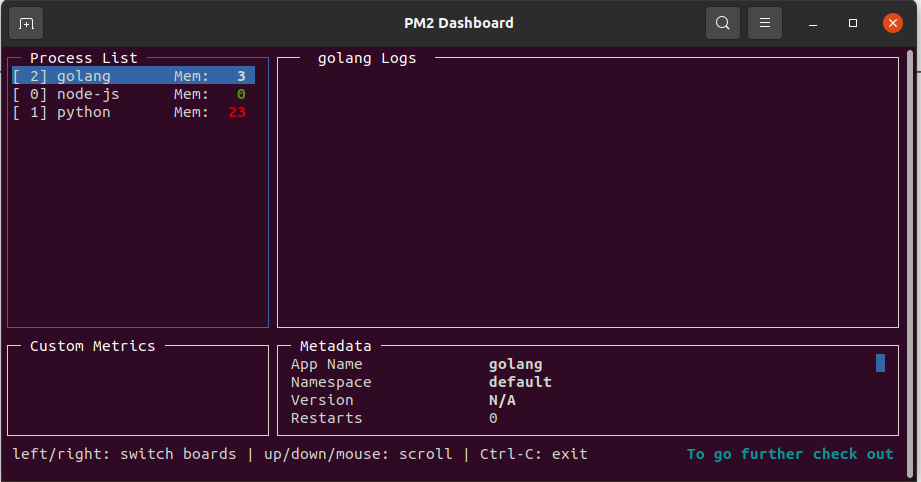
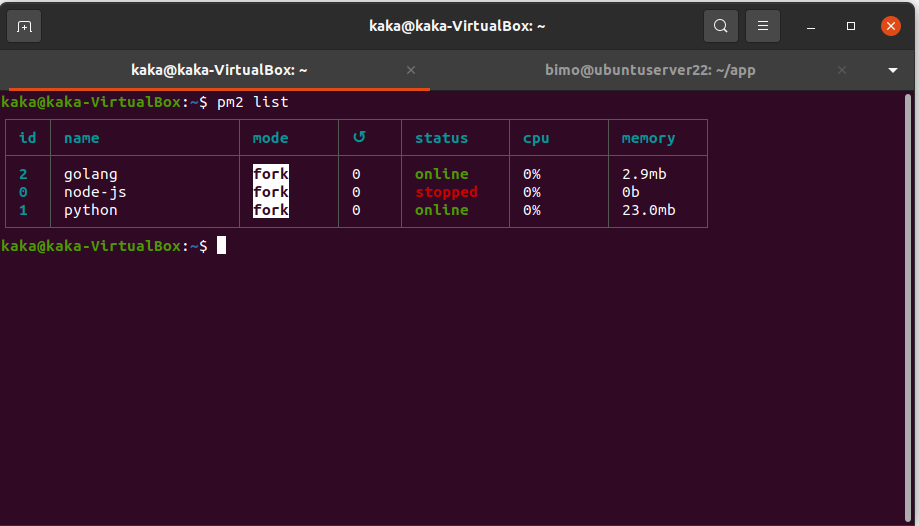

# Dokumentasi Cara memonitoring aplikasi kita sedang berjalan atau tidak sedang berjalan
Berikut adalah Study Case cara memonitoring ketika aplikasi kita mati dan tahap2 apa saja untuk melakukan monitoringnya:

### Ketika aplikasi kita tidak berjalan atau mati seperti berikut:
- 
 
### kita bisa cek dari status nginxnya aktif atau tidaknya nginx seperti berikut:
- 

### Kemudian setelah status nginx dicek aktif, kita cek firewallnya. Karena bisa saja ternyata kita lupa mengaktifkan, seperti berikut:
- 

### Jika setelah dicek firewall sudah allow kemudian kita bisa cek dengan pm2 monitoring dengan menjalankan perintah seperti berikut:
- pm2 monit
- 

### dan bisa juga kita cek dari status aktif atau tidaknya dengan pm2 list seperti berikut:
- pm2 list
- 