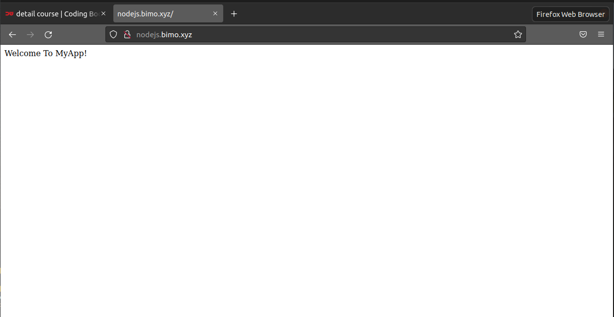

# Dokumentasi Cara Membuat Reverse Proxy
Berikut adalah dokumentasi proses pembuatan dari setiap aplikasi:

## Langkah-langkah reverse proxy dan pembuatan domain Aplikasi Nodejs
### Pertama masuk kedalam folder /etc/nginx, kemudian buat sebuah direktori untuk menjadi tempat untuk file domain. lalu buat file nodejs.bimo.xyz, berikut perintah-perintahnya:
- cd /etc/nginx
- mkdir domain
- cd domain
- sudo nano nodejs.bimo.xyz
- 

- sudo nginx -t
- 

### Dan setelah itu kita edit file nginx.conf didalamnya kita masukkan include /etc/nginx/domain/*;
- sudo nano nginx.conf
- 

### Kemudian kita buat virtual host di local kita dan masukkan ip dan nama domainnya, berikut perintah-perintahnya;
- sudo nano /etc/hosts
- 
- sudo systemctl reload nginx
- 

### Terakhir masuk kedalam folder app-nodejs dan jalankan node index.js. Setelah aplikasi berjalan kita buka domain pada browser, berikut perintah-perintahnya;
- cd ~/Dumbways/app-nodejs
- node index.js
- 

## Langkah-langkah reverse proxy dan pembuatan domain Aplikasi Python
### Pertama masuk kedalam folder /etc/nginx, kemudian masuk kedalam direktori domain lalu buat file python.bimo.xyz, berikut perintah-perintahnya:
- cd /etc/nginx
- cd domain
- sudo nano python.bimo.xyz
- 
- 

### Setelah selesai save dan buat virtual host dilocal kita. Didalamnya kita isikan ip dan nama domain kita, berikut perintahnya:
- sudo nano /etc/hosts
- 
- sudo systemctl reload nginx

### Langkah berikutnya kita pindah direktori ke cd ~/Dumbways/app-nodejs dan jalankan index.py, berikut perintahnya:
- cd ~/Dumbways/app-python
- python3 index.py
- 

### Terakhir buka pada browser domainnya python.bimo.xyz
- 

## Langkah-langkah reverse proxy dan pembuatan domain Aplikasi Golang
### Pertama masuk kedalam folder /etc/nginx, kemudian masuk kedalam direktori domain lalu buat file golang.bimo.xyz, berikut perintah-perintahnya:
- cd /etc/nginx
- cd domain
- sudo nano golang.bimo.xyz
- 
- 

### Setelah selesai save dan buat virtual host dilocal kita. Didalamnya kita isikan ip dan nama domain kita, berikut perintahnya:
- sudo nano /etc/hosts
- 
- sudo systemctl reload nginx

### Langkah berikutnya kita pindah direktori ke cd ~/Dumbways/app-golang dan jalankan go run index.go kemudian build dengan go build index.go, berikut perintahnya:
- cd ~/Dumbways/app-golang
- go run index.go
- go build index.go
- ./index
- 

### Terakhir buka pada browser domainnya golang.bimo.xyz
- 
